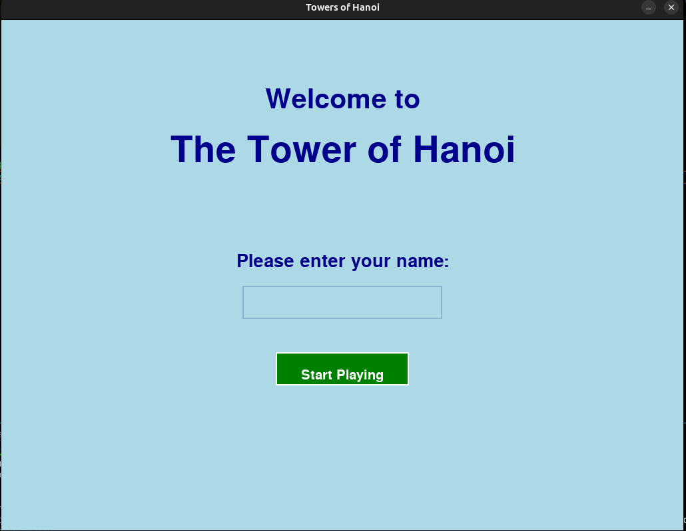

# Tower of Hanoi Game

Welcome to the Tower of Hanoi game, an extraordinary implementation using Python and the Pygame package. This project aims to provide an interactive and engaging way to play the classic Tower of Hanoi puzzle.

## Introduction

The Tower of Hanoi is a classic mathematical puzzle that involves moving a stack of disks from one rod to another, following specific rules. This project brings the puzzle to life with a graphical user interface, making it accessible and fun to play.

## Features

- **Graphical Interface**: Enjoy the game with a visually appealing interface created using Pygame.
- **Difficulty Levels**: Choose from three difficulty levels - easy (3 disks), medium (5 disks), and hard (7 disks).
- **User Interaction**: Enter your name, select difficulty, and start playing with intuitive controls.
- **Game Rules**: View the rules of the game to understand how to play and win.
- **Lives System**: You have 3 lives; an invalid move will reduce your life by one.
- **Move Counter**: Track your total number of moves and see if you can solve the puzzle within the minimum required moves.
- **Replay and Exit**: Option to replay the game or exit after losing all lives or completing the game.

## Installation

To run this game on your local machine, follow these steps:

1. **Clone the Repository**:
    ```sh
    git clone https://Jeevanreddy-2005/Tower-of-Hanoi-Game.git
    cd tower-of-hanoi-game
    ```

2. **Install Required Packages**:
    Make sure you have Python installed. Then, install the Pygame package:
    ```sh
    pip install pygame
    ```

3. **Run the Game**:
    ```sh
    python main.py
    ```

## How to Play

1. **Start the Game**: Run the `main.py` file to start the game.
2. **Enter Your Name**: Provide your name to personalize the game experience.
3. **Select Difficulty**: Choose a difficulty level - easy, medium, or hard.
4. **View Rules**: Familiarize yourself with the game rules to play effectively.
5. **Play the Game**: Use the arrow keys to move the top disk between rods. Your goal is to move all disks from the source rod to the destination rod following the game rules:
   - Only one disk can be moved at a time.
   - A disk can only be placed on top of a larger disk or an empty rod.
   - You have 3 lives; an invalid move will cost you a life.
6. **Win or Lose**: Complete the puzzle within the given moves or lose all lives to finish the game. You can choose to replay or exit afterward.

## Screenshots

Here are some screenshots of the game:

### Name Entry


### Main Menu


### Rules of the Game


### Game Play


### Winning Screen


## License

This project is licensed under the MIT License - see the [LICENSE](LICENSE) file for details.
